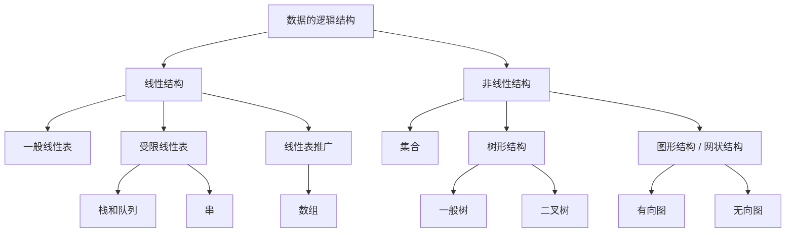

# 数据的逻辑结构

1) **集合** 除同属一个集合外没有任何联系
2) **线性结构** 只有一对一
3) **树形结构** 只有一对多
4) **网状或图状结构** 存在多对多关系
# 数据的存储结构
- **顺序存储**
- **链式存储**
- **索引存储**
- **散列存储**：根据关键字直接计算出该元素的存储地址
# 数据的运算
- 施加在数据上的运算包括运算的*定义*和*实现*。